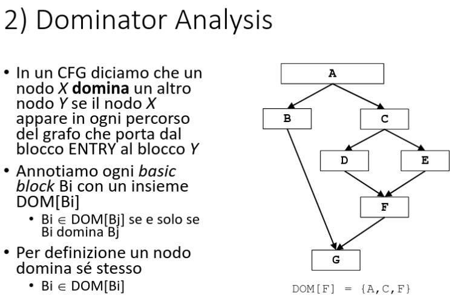
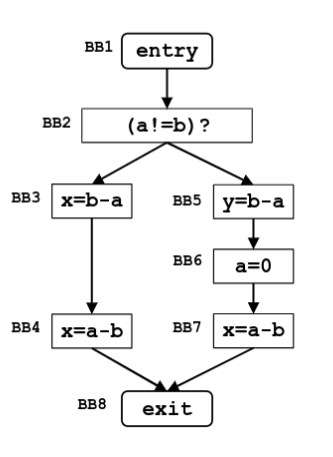

# Consegna

# Esercizio

## Very busy expression

|                        | Available expressions                                                                         |
| ---------------------- | --------------------------------------------------------------------------------------------- |
| domain                 | set delle espressioni                                                                         |
| direction              | backward: $$\begin{gather} in[b]=f_b(out[b]) \\ out[b] = \wedge in[succ(b)]\end{gather} $$ |
| transfer function      | $$f_b(x) = GEN_b\cup (x-KILL_b)$$                                                             |
| meet operation         | $\cap$                                                                                        |
| boundary condition     | $in[exit]=\emptyset$                                                                          |
| inital interior points | $in[b] = U$                                                                                   |

Non essendoci un loop si fa il calcolo solo della prima iterazione:

| BB  | $IN[B]$        | $OUT [B]$   |
| --- | -------------- | ----------- |
| BB2 | $\{b-a\}$      | $\{b-a\}$   |
| BB3 | $\{b-a, a-b\}$ | $\{a-b\}$   |
| BB4 | $\{a-b\}$      | $\emptyset$ |
| BB5 | $\{b-a\}$      | $\emptyset$ |
| BB6 | $\emptyset$    | $\{a-b\}$   |
| BB7 | $\{a-b\}$      | $\emptyset$ |
| BB8 | $\emptyset$    | $\emptyset$ |

## Dominator Analysis

|                        | Available expressions                                                                        |
| ---------------------- | -------------------------------------------------------------------------------------------- |
| domain                 | L'insieme dei blocchi di base nel CFG                                                        |
| direction              | forward: $$\begin{gather} out[b]=f_b(in[b]) \\ in[b] = \wedge out[pred(b)]\end{gather} $$ |
| transfer function      | $$f_b(x) = \{B_j\} \cup x$$                                                                  |
| meet operation         | $\cap$                                                                                       |
| boundary condition     | $out[entry]=entry$                                                                           |
| inital interior points | $out[b] = U$                                                                                 |

| BB  | Iterazione 1 $IN[B]$ | Iterazione 1 $OUT [B]$ |
| --- | -------------------- | ---------------------- |
| A   | $\emptyset$          | $\{A\}$                |
| B   | $\{A\}$              | $\{A,B\}$              |
| C   | $\{A\}$              | $\{A,C\}$              |
| D   | $\{A,C\}$            | $\{A,C,D\}$            |
| E   | $\{A,C\}$            | $\{A,C,E\}$            |
| F   | $\{A,C\}$            | $\{A,C,F\}$            |
| G   | $\{A,C,D\}$          | $\{A,G\}$              |

## Constant propagation

|                        | Available expressions                                                                        |
| ---------------------- | -------------------------------------------------------------------------------------------- |
| domain                 | set delle espressioni                                                                        |
| direction              | forward: $$\begin{gather} out[b]=f_b(in[b]) \\ in[b] = \wedge out[pred(b)]\end{gather} $$ |
| transfer function      | $$f_b(x) = B_j \cup x$$                                                                      |
| meet operation         | $\cap$                                                                                       |
| boundary condition     | $out[entry]=\emptyset$                                                                       |
| inital interior points | $out[b] = \emptyset$                                                                         |

| BB   | Iterazione 1 $IN[B]$                     | Iterazione 1 $OUT [B]$                   | Iterazione 2 $IN[B]$                     | Iterazione 2 $OUT [B]$  | Iterazione 3 $IN[B]$                     | Iterazione 4 $OUT [B]$  |
| ---- | ---------------------------------------- | ---------------------------------------- | ---------------------------------------- | ----------------------- | ---------------------------------------- | ----------------------- |
| BB1  | $\emptyset$                              | $\{(k, 2)\}$                             |                                          |                         |                                          |                         |
| BB2  | $\{(k, 2)\}$                             | $\{(k, 2)\}$                             |                                          |                         |                                          |                         |
| BB3  | $\{(k,2)\}$                              | $\{(a, 4), (k,2)\}$                      |                                          |                         |                                          |                         |
| BB4  | $\{(a, 4), (k,2)\}$                      | $\{(x,5), (a, 4), (k,2)\}$               |                                          |                         |                                          |                         |
| BB5  | $\{(k,2)\}$                              | $\{(a,4),(k,2)\}$                        |                                          |                         |                                          |                         |
| BB6  | $\{(a,4),(k,2)\}$                        | $\{(x,8),(a,4),(k,2)\}$                  |                                          |                         |                                          |                         |
| BB7  | $\{(k,4), (a,4)\}$                       | $\{(k,4), (a,4)\}$                       |                                          |                         |                                          |                         |
| BB8  | $\{(k,4), (a,4)\}$                       | $\{(k,4), (a,4)\}$                       | $\{(b,2), (k,5), (a,4), (x,8), (y, 8)\}$ | $\{(a,4)\}$             | $\{(b,2), (k,5), (a,4), (x,8), (y, 8)\}$ | $\{(a,4)\}$             |
| BB9  | $\{(k,4), (a,4)\}$                       | $\{(b,2), (k,4), (a,4)\}$                | $\{(a,4)\}$                              | $\{(b,2),(a,4)\}$       | $\{(a,4)\}$                              | $\{(b,2),(a,4)\}$       |
| BB10 | $\{(b,2), (k,4), (a,4)\}$                | $\{(b,2), (k,4), (a,4), (x,8)\}$         | $\{(b,2),(a,4)\}$                        | $\{(b,2),(a,4)\}$       | $\{(b,2),(a,4)\}$                        | $\{(b,2),(a,4)\}$       |
| BB11 | $\{(b,2), (k,4), (a,4), (x,8)\}$         | $\{(b,2), (k,4), (a,4), (x,8), (y, 8)\}$ | $\{(b,2),(a,4)\}$                        | $\{(y,8),(b,2),(a,4)\}$ | $\{(b,2),(a,4)\}$                        | $\{(y,8),(b,2),(a,4)\}$ |
| BB12 | $\{(b,2), (k,4), (a,4), (x,8), (y, 8)\}$ | $\{(b,2), (k,5), (a,4), (x,8), (y, 8)\}$ | $\{(y,8),(b,2),(a,4)\}$                  | $\{(y,8),(b,2),(a,4)\}$ | $\{(y,8),(b,2),(a,4)\}$                  | $\{(y,8),(b,2),(a,4)\}$ |
| BB13 | $\{(k,4)(a,4)\}$                         | $\{(k,4)(a,4)\}$                         | $\{(a,4)\}$                              | $\{(a,4)\}$             | $\{(a,4)\}$                              | $\{(a,4)\}$             |
| BB14 | $\{(k,4)(a,4)\}$                         | $\{(k,4)(a,4)\}$                         | $\{(a,4)\}$                              | $\{(a,4)\}$             | $\{(a,4)\}$                              | $\{(a,4)\}$             |
